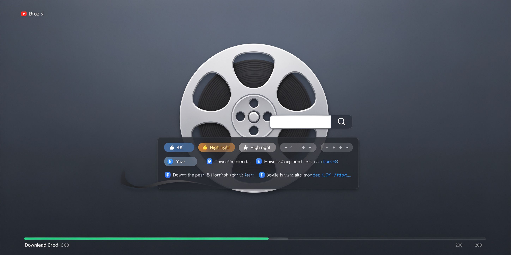

# movie-resource-automation

**影视站自动搜片：登录→搜索→筛选 4K/豆瓣≥7→批量提取磁力。**

  

## 流程

1. 登录（cookie HttpOnly，同源 fetch 自动带）
2. SPA 路由筛选：`/mv?year=2026&sort=score&quality=4k`
3. 浏览器 console 批量提取磁力
4. 按做种数排序，≤35G 优先

## License

MIT
