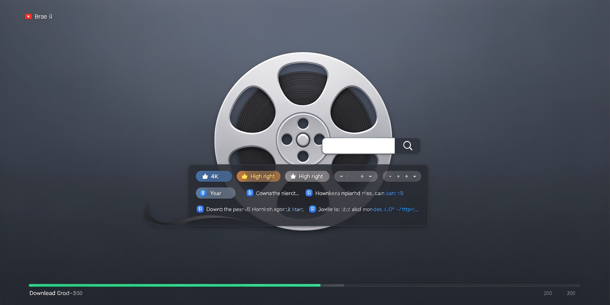

<div align="center">

# 电影资源自动化

**登录→SPA 路由筛选 4K/评分最高→一条 API 批量提取磁力，按做种排序。**


[它解决什么问题](#它解决什么问题) - [为什么比手动强](#为什么比手动强) - [工作流](#工作流) - [实测参数](#实测参数) - [快速开始](#快速开始)

</div>

---

## 它解决什么问题

要"给我 2026 年 + 4K + 高分 + 不超过 35G 的电影下载链接"。手动在影视站翻列表、逐个点详情页、复制磁力、判断清晰度和大小，一晚上挑不出几部。站点 cookie 是 HttpOnly 读不到，让人以为没法编程化；其实同源 fetch 会自动带 cookie，还藏着一条直接返回 JSON 的资源 API。

## 为什么比手动强

| 手动翻列表挑资源 | 本仓库 |
|---|---|
| 逐个点详情页找磁力 | 一条 `GET /res/downurl/mv/{id}` 直接返回 downlist JSON |
| 以为 cookie 读不到就没法自动化 | cookie 虽 HttpOnly，同源 fetch 自动携带 |
| 手动判断 4K / 大小 / 做种 | 脚本按 4K、≤35G、做种数排序一次筛完 |
| 评分要进详情页才看到 | SPA 路由 `quality=4k&sort=score` 直接筛 |
| 每页手动翻 | 脚本 console 循环批量提取 |

## 工作流

```
① 登录（过 JS 安全验证；cookie HttpOnly，同源 fetch 自动带）
   ↓
② SPA 路由筛选：/mv?year=2026&sort=score&quality=4k&page=N
   ↓
③ 取 movieId（详情页 URL /mv/{id}）
   ↓
④ 核心 API：GET /res/downurl/mv/{id} → downlist.list
   ↓
⑤ 按做种数排序、≤35G 优先，拼 magnet:?xt=urn:btih:{hash}
```

## 实测参数

- **核心 API**：`GET /res/downurl/mv/{movieId}` 返回 `downlist.list`，字段 `m`(磁力哈希) `t`(标题含清晰度) `s`(大小"2.19G") `e`(做种数) `n`(发布时间)
- **路由**：电影 `/mv`、剧集 `/tv`、动漫 `/ac`；筛选参数 year / area / quality(720P/1080P/4K/BD/HDR/DV) / sort=score / page
- **评分坑**：列表项链接文本第一个浮点数是 IMDB 分，豆瓣分只在详情页
- **批量脚本**：`scripts/batch_extract_magnets.js`（含 4K≤35G 过滤与做种排序）
- **实测日期**：2026-08-13

## 快速开始

```javascript
// 1. 浏览器登录后，直接在 console 用同源 fetch（cookie 自动带）
// 2. 列表页跳转筛选路由
//    /mv?year=2026&sort=score&quality=4k

// 3. 对每个 movieId 调核心 API
//    GET /res/downurl/mv/{movieId}
//    → 遍历 downlist.list，按 s ≤35G、t 含 4K、e(做种数) 排序
```

## License

MIT
